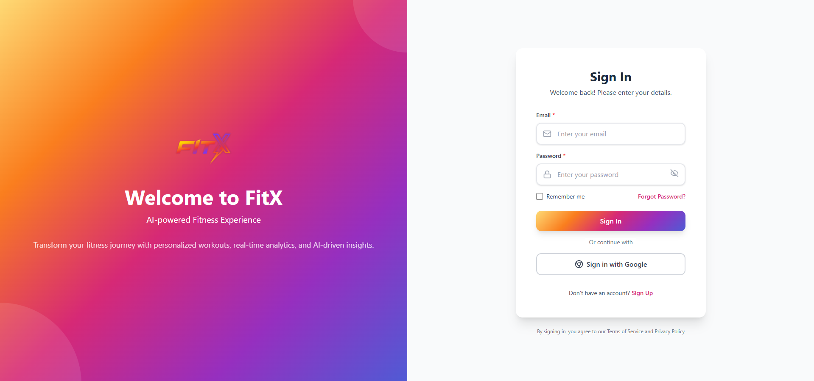
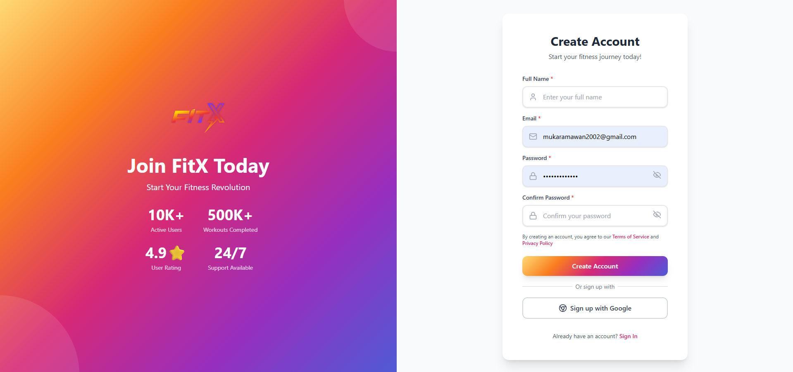
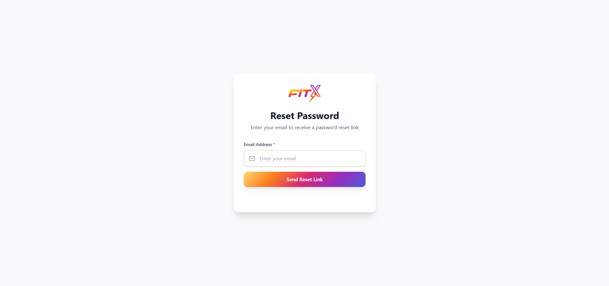
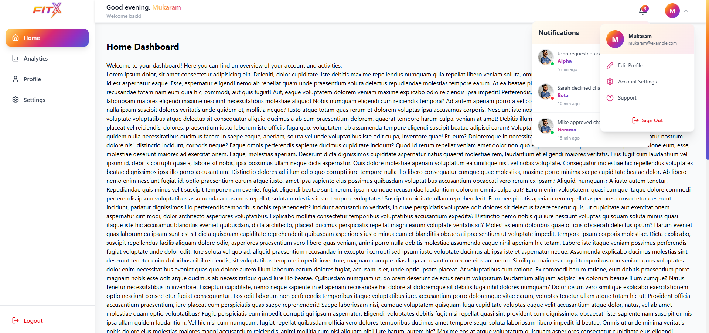

# 🚀 React Dashboard Boilerplate

A modern, feature-rich React dashboard boilerplate built with Vite, Tailwind CSS, Framer Motion, and Supabase authentication. Perfect for kickstarting your next SaaS, admin panel, or web application project.


## ✨ Features

### 🔐 Authentication
- **Complete Auth System** powered by Supabase
  - Sign In / Sign Up with email and password
  - Google OAuth integration
  - Password reset flow with email verification
  - Protected routes with authentication guards
  - Persistent user sessions
  - Password validation with strength requirements

### 🎨 Modern UI/UX
- **Instagram-inspired gradient theme** throughout the application
- **Fully responsive design** - mobile, tablet, and desktop optimized
- **Collapsible sidebar** with hamburger menu for mobile
- **Smooth animations** with Framer Motion
- **Custom reusable components**:
  - CustomButton with gradient and outline variants
  - CustomInput with icon support and validation
  - Layout with Sidebar and Topbar
  - User and Notification dropdowns

### 📊 Dashboard Pages
- **Home** - Main dashboard overview
- **Analytics** - Data visualization and insights
- **Profile** - User profile management
- **Settings** - Application settings

### 🎯 Developer Experience
- **Vite** for lightning-fast HMR and builds
- **ESLint** configured for code quality
- **Modular architecture** with clear separation of concerns
- **Context API** for state management
- **React Router** for navigation
- **Lucide React** for beautiful, consistent icons

## 📸 Screenshots

### Authentication Pages
**Sign In**


**Sign Up**


**Password Reset**


### Dashboard
**Desktop View**



## 🛠️ Tech Stack

- **Frontend Framework**: React 19.1.1
- **Build Tool**: Vite 7.1.7
- **Styling**: Tailwind CSS 4.1.14
- **Animations**: Framer Motion 12.23.24
- **Icons**: Lucide React 0.546.0
- **Authentication**: Supabase 2.75.1
- **Routing**: React Router DOM 7.9.4
- **Charts**: Recharts 3.3.0

## 🚀 Getting Started

### Prerequisites
- Node.js 18+ and npm/yarn/pnpm
- Supabase account (free tier available)

### Installation

1. **Clone the repository**
   ```bash
   git clone https://github.com/yourusername/react-dashboard-boilerplate.git
   cd react-dashboard-boilerplate
   ```

2. **Install dependencies**
   ```bash
   npm install
   # or
   yarn install
   # or
   pnpm install
   ```

3. **Set up environment variables**
   
   Create a `.env` file in the root directory:
   ```env
   VITE_SUPABASE_URL=your_supabase_project_url
   VITE_SUPABASE_ANON_KEY=your_supabase_anon_key
   ```

   To get your Supabase credentials:
   - Go to [supabase.com](https://supabase.com)
   - Create a new project or use existing one
   - Go to Project Settings > API
   - Copy the `Project URL` and `anon public` key

4. **Configure Supabase Authentication**
   
   In your Supabase dashboard:
   - Go to Authentication > Providers
   - Enable Email provider
   - Enable Google OAuth (optional):
     - Configure Google OAuth credentials
     - Add authorized redirect URLs
   - Configure email templates for password reset

5. **Run the development server**
   ```bash
   npm run dev
   ```

   Open [http://localhost:5173](http://localhost:5173) in your browser.

## 📁 Project Structure

```
react-dashboard-boilerplate/
├── public/              # Static assets
├── src/
│   ├── assets/         # Images, fonts, etc.
│   ├── components/     # Reusable UI components
│   │   ├── CustomButton.jsx
│   │   ├── CustomInput.jsx
│   │   ├── Layout.jsx
│   │   ├── Sidebar.jsx
│   │   ├── Topbar.jsx
│   │   ├── ProtectedRoute.jsx
│   │   ├── UserDropdown.jsx
│   │   └── NotificationDropdown.jsx
│   ├── context/        # React Context providers
│   │   └── AuthContext.jsx
│   ├── pages/          # Page components
│   │   ├── auth/
│   │   │   ├── SignIn.jsx
│   │   │   ├── SignUp.jsx
│   │   │   ├── ForgotPassword.jsx
│   │   │   └── ResetPassword.jsx
│   │   ├── Home.jsx
│   │   ├── Analytics.jsx
│   │   ├── Profile.jsx
│   │   └── Settings.jsx
│   ├── utils/          # Utility functions
│   │   └── passwordValidation.js
│   ├── App.jsx         # Main app component
│   ├── main.jsx        # Entry point
│   ├── supabaseClient.js  # Supabase configuration
│   └── theme.js        # Theme configuration
├── .env                # Environment variables (create this)
├── package.json
├── vite.config.js
└── README.md
```

## 🎨 Customization

### Theme
Edit `src/theme.js` to customize colors, gradients, and shadows:
```javascript
export const theme = {
  colors: {
    primary: { /* your colors */ },
    background: { /* your colors */ },
  },
  gradients: {
    primary: 'your-gradient',
  },
};
```

### Routes
Add or modify routes in `src/App.jsx`:
```javascript
<Route path="/your-route" element={<YourComponent />} />
```

### Components
All reusable components are in `src/components/` and can be easily customized or extended.

## 📝 Available Scripts

```bash
npm run dev      # Start development server
npm run build    # Build for production
npm run preview  # Preview production build
npm run lint     # Run ESLint
```

## 🔒 Security Features

- ✅ Password strength validation (min 8 chars, uppercase, lowercase, number, special char)
- ✅ Protected routes requiring authentication
- ✅ Secure password reset flow with email verification
- ✅ Session management with automatic token refresh
- ✅ XSS protection with React's built-in safeguards
- ✅ Environment variable isolation

## 🌐 Browser Support

- Chrome (latest)
- Firefox (latest)
- Safari (latest)
- Edge (latest)


1. Fork the repository
2. Create your feature branch (`git checkout -b feature/AmazingFeature`)
3. Commit your changes (`git commit -m 'Add some AmazingFeature'`)
4. Push to the branch (`git push origin feature/AmazingFeature`)
5. Open a Pull Request


## 🙏 Acknowledgments

- [React](https://react.dev/) - UI library
- [Vite](https://vite.dev/) - Build tool
- [Tailwind CSS](https://tailwindcss.com/) - Styling
- [Framer Motion](https://www.framer.com/motion/) - Animations
- [Supabase](https://supabase.com/) - Backend & Auth
- [Lucide](https://lucide.dev/) - Icons

## 🤝 Contributing

Contributions are welcome! Please feel free to submit a Pull Request.

## 📧 Contact

For questions or support, please open an issue or reach out to [mukaramawan.official@gmail.com](mailto:mukaramawan.official@gmail.com).

---

**Star ⭐ this repository if you find it helpful!**
